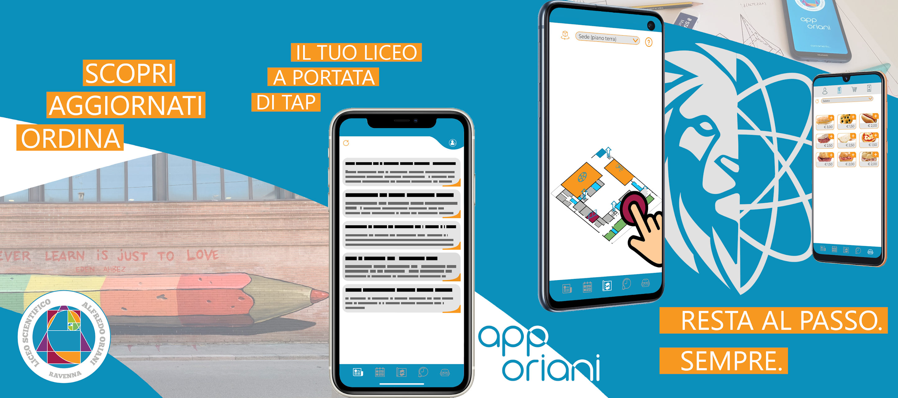

# App Oriani
A mobile app for the students at Liceo Scientifico "Alfredo Oriani" in Ravenna.

## Functions
📰 A bullletin board constantly updated with the latest news

📆 A school events calendar you can filter by keywords, categories, and month

🧭 An isometric, animated, interactive map for school grounds

🧪 A weekly timetable to keep up on morning and afternoon activities for each lab

🥪 A tab allowing students to place orders at the school bar

## Downloads
- [Google Play](https://play.google.com/store/apps/details?id=it.edu.liceoscientificoravenna.apporiani&gl=IT)
- [App Store](https://apps.apple.com/it/app/app-oriani/id1531844939)
- [AppGallery](https://appgallery.cloud.huawei.com/ag/n/app/C103011083?channelId=sito_liceo&id=5013601de18f4a67ad24e8227ad50bda&s=63F68391FEF91BE5BFAD3EE9B39B956D7AE6896733B67F1239647995DACD97EE&detailType=0&v=)
